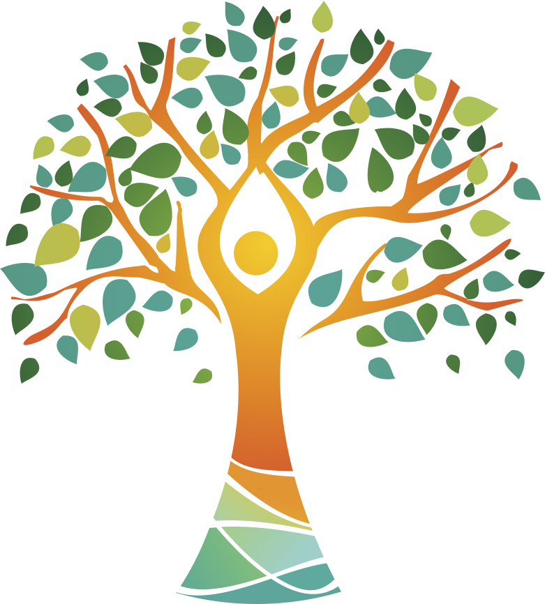

 # Genes, genealogies and the evolution of demographic change and social inequality

 

GENPOP is a project funded by the European Research Council.
### Principal investigator: [Nicola Barban](www.nicolabarban.com)

## Project description

**Big Data for investigating demographic processes**

Demographic change and inequality mark modern society, making indispensable the understanding of demographic processes and the planning of effective policies essential. As demographic processes evolve slowly across generations, the combination of historical with current data can help in understanding the process of population evolution. **The EU-funded GENPOP project will investigate long-term demographic processes in family networks from 1800 until today by using existing data on internet-based genealogies.** It will use innovative Big Data and micro-census data to examine fertility and mortality in family networks and diversity between and within families across generations, to understand the impact migration had on the different generations and to delineate the long-term models of assortative mating.

## Objective

This is the first comprehensive study that combines historical and contemporaneous data to understand how population processes evolve via three interrelated channels:
1. multigenerational transmission,
2. assortative mating and
3. migration.

Existing research focuses on recent factors to explain contemporaneous population trends, missing the long-view of demographic changes. As population processes (fertility and mortality) evolve slowly across generations, we urgently need to adopt a long-term perspective to comprehend demographic phenomena and design effective policies.
